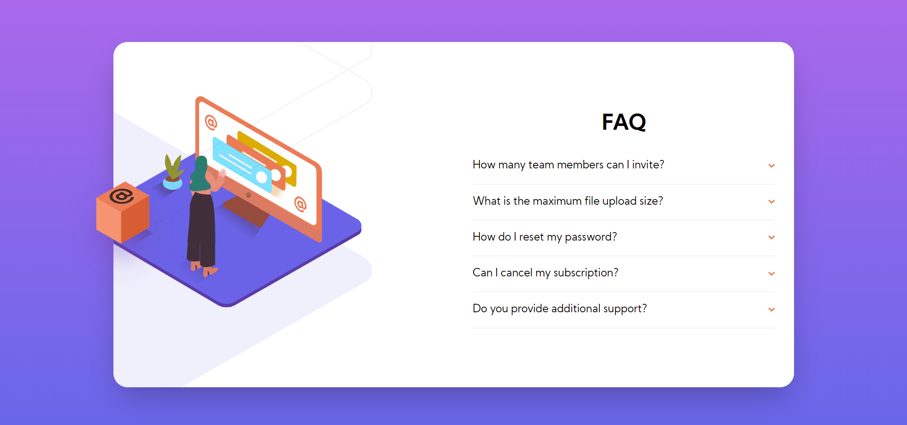

# Frontend Mentor - FAQ accordion card solution

This is a solution to the [FAQ accordion card challenge on Frontend Mentor](https://www.frontendmentor.io/challenges/faq-accordion-card-XlyjD0Oam). Frontend Mentor challenges help you improve your coding skills by building realistic projects. 

## Table of contents

1. [Frontend Mentor - FAQ accordion card solution](#frontend-mentor---faq-accordion-card-solution)
	1. [Table of contents](#table-of-contents)
		1. [The challenge](#the-challenge)
		2. [Screenshot](#screenshot)
		3. [Links](#links)
		4. [Built with](#built-with)
	2. [Author](#author)
### The challenge

Users should be able to:

- View the optimal layout for the component depending on their device's screen size
- See hover states for all interactive elements on the page
- Hide/Show the answer to a question when the question is clicked

### Screenshot

### Links

- Solution URL: [Frontend mentor](https://www.frontendmentor.io/solutions/faq-accordion-card-with-reactjs-and-tailwindcss-CjcjuQRvl)
- Live Site URL: [Live site](https://faq-accordion-card-zynth17.vercel.app/)

### Built with

- Semantic HTML5 markup
- CSS custom properties
- Flexbox
- Mobile-first workflow
- [React](https://reactjs.org/) - JS library
- [TailwindCSS](https://tailwindcss.com/) - CSS Utilities Library

## Author

- Website - [creeve.me](https://creeve.me)
- Frontend Mentor - [@zynth17](https://www.frontendmentor.io/profile/zynth17)
- Twitter - [@hi_reeve](https://twitter.com/hi_reeve)
- Instagram - [@hi_reeve](https://www.instagram.com/hi_reeve/)
- Github - [zynth17](https://github.com/zynth17)